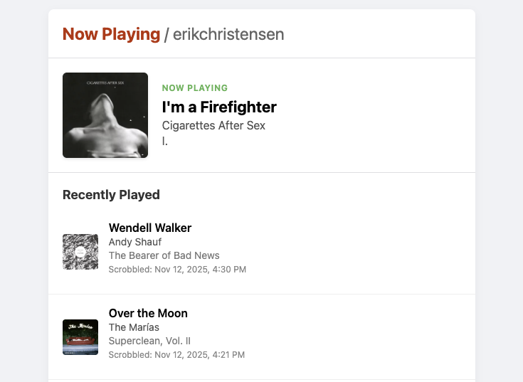

# Last.fm "Now Playing" Docker Compose App

This is a simple, self-contained web application that displays the current "Now Playing" track and a list of recently played tracks for a specific Last.fm user.

It is designed to be deployed as a Docker container, where the `LASTFM_USER` and `LASTFM_API_KEY` are securely configured at runtime using environment variables.

The frontend is a clean, single-page view that automatically refreshes its data.



## Features

* **Now Playing:** Displays the user's currently scrobbling track, including album art, title, artist, and album.
* **Recent Tracks:** Shows a list of recently played tracks with their metadata.
* **Auto-Refresh:** Automatically fetches new data from the Last.fm API every 15 seconds.
* **Containerized:** Runs as a standalone, lightweight Docker container.
* **Securely Configured:** No hard-coded keys. Your Last.fm user and API key are passed in via environment variables, making it safe to share or store the code in source control.
* **Simple Stack:** Built with a minimal Node.js/Express backend to inject variables and serve a clean HTML, CSS, and vanilla JavaScript frontend.

## Project Structure

```none
/now-playing-lastfm
├── public/
│   ├── index.html
│   ├── style.css
│   └── app.js
├── package.json
├── server.js
├── Dockerfile
└── docker-compose.yml
```

## Configuration

Set last.fm username and API key in `docker-compose.yml`

```yml
environment:
    - LASTFM_USER=your-lastfm-username
    - LASTFM_API_KEY=your-lastfm-api-key
    - REFRESH_INTERVAL_MS=15000
```

## Running the App

```bash
docker-compose up --build
```

Navigate to <http://localhost:3000/>